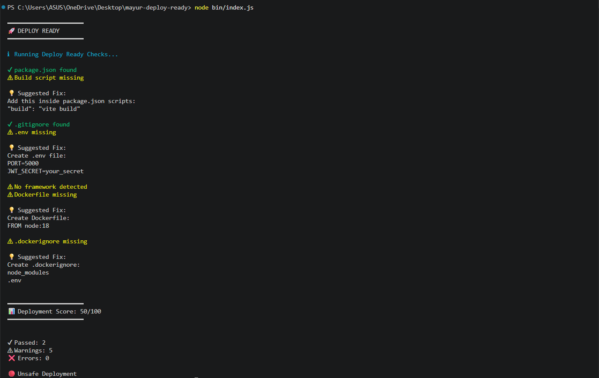
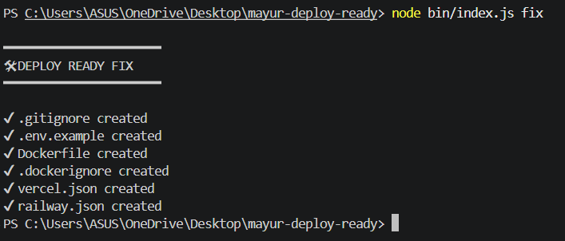
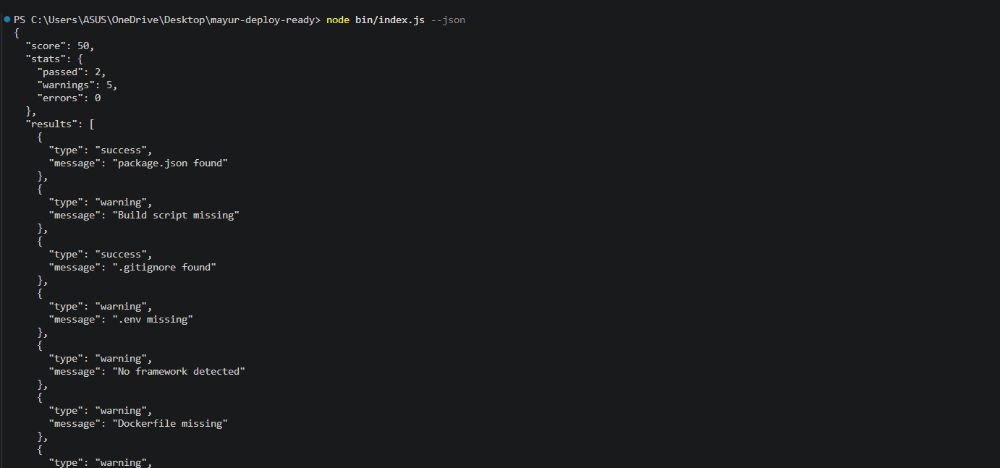

<div align="center">

# 🚀 mayur-deploy-ready

**Analyze, score, and fix your project's deployment readiness — before it hits production.**

[](https://opensource.org/licenses/MIT)
[](https://nodejs.org/)


A zero-config CLI tool that detects missing deployment configurations, Docker setup issues, security vulnerabilities, and platform-specific requirements — all before you push to production.

[Installation](#-installation) · [Usage](#-usage) · [Features](#-features) · [Project Structure](#-project-structure) · [Contributing](#-contributing)

</div>

---

## 🎯 Overview

**mayur-deploy-ready** is a comprehensive deployment readiness analyzer that helps developers catch deployment issues early. It performs automated checks across multiple categories including package configuration, Docker setup, security, framework-specific requirements, and platform deployment configs.

### Why Use This Tool?

- ✅ **Catch issues before deployment** - Identify missing files and misconfigurations locally
- ✅ **Save debugging time** - Avoid broken deployments and production incidents
- ✅ **Learn best practices** - Get actionable suggestions for every issue found
- ✅ **Automate fixes** - Generate missing files with sensible defaults
- ✅ **CI/CD integration** - Use in GitHub Actions, Jenkins, GitLab CI, and more
- ✅ **Framework-aware** - Detects Express, React, Vite and validates accordingly

---

## 📦 Installation

### Installation from Source

Since this package is not yet published to npm, install it locally:

```bash
# Clone the repository
git clone https://github.com/mayurCoder2004/mayur-deploy-ready.git

# Navigate to the directory
cd mayur-deploy-ready

# Install dependencies
npm install

# Link globally to use the CLI
npm link
```

### After Publishing to npm

Once published, you can install globally:

```bash
npm install -g mayur-deploy-ready
```

**Requirements:** Node.js >= 18

---

## 🚀 Usage

### 1️⃣ Standard Analysis Mode

Run from your project root directory:

```bash
mayur-deploy-ready
```

This performs a comprehensive analysis of your project and provides:
- ✅ **Deployment readiness score** (0-100)
- 📊 **Detailed check results** with pass/warning/error status
- 💡 **Actionable suggestions** for fixing issues
- 🎨 **Color-coded output** for easy scanning

#### Demo: Standard Analysis Mode



*The standard mode provides a comprehensive deployment readiness report with colored output, showing all checks performed, issues found, and a final deployment score.*

---

### 2️⃣ Fix Mode (Auto-Repair)

```bash
mayur-deploy-ready fix
```

Automatically generates missing deployment files with production-ready defaults:

| File Generated | Purpose |
|----------------|---------|
| `.gitignore` | Prevents committing `node_modules`, `.env`, build artifacts |
| `.dockerignore` | Keeps Docker images lean by excluding dev dependencies |
| `Dockerfile` | Production-ready Node.js container configuration |
| `.env.example` | Documents required environment variables for your team |
| `routes/` | Creates Express routes folder structure |
| `vercel.json` | Vercel deployment configuration |
| `railway.json` | Railway deployment configuration |
| **package.json** | Adds missing `start`, `build`, and `test` scripts |

> **Note:** Fix mode only creates files that don't exist. Existing files are never overwritten to preserve your custom configurations.

#### Demo: Fix Mode



*Fix mode automatically scaffolds missing deployment files and configurations, showing exactly what was created to make your project deployment-ready.*

---

### 3️⃣ JSON Output Mode

```bash
mayur-deploy-ready --json
```

Returns structured JSON output ideal for:
- 🤖 **CI/CD pipelines** - Parse results programmatically
- 📊 **Dashboards** - Build deployment readiness metrics
- 🔗 **Tool integration** - Pipe into other automation tools
- 📝 **Logging** - Store historical deployment readiness data

#### JSON Output Structure

```json
{
  "score": 85,
  "stats": {
    "passed": 6,
    "warnings": 2,
    "errors": 0
  },
  "results": [
    {
      "type": "success",
      "message": "package.json found"
    },
    {
      "type": "warning",
      "message": "Dockerfile missing"
    }
  ]
}
```

#### Demo: JSON Output Mode



*JSON mode provides machine-readable output perfect for CI/CD integration, automation scripts, and building deployment dashboards.*

---

### 4️⃣ CI/CD Mode

```bash
mayur-deploy-ready --ci
```

Silent validation mode with meaningful exit codes:

| Exit Code | Status | Description |
|-----------|--------|-------------|
| `0` | ✅ **Pass** | Deployment ready (score >= 85) |
| `1` | ❌ **Fail** | Deployment unsafe (score < 85) |

#### GitHub Actions Integration

```yaml
name: Deployment Readiness Check

on: [push, pull_request]

jobs:
  deploy-check:
    runs-on: ubuntu-latest
    steps:
      - uses: actions/checkout@v3
      
      - name: Setup Node.js
        uses: actions/setup-node@v3
        with:
          node-version: '18'
      
      - name: Install mayur-deploy-ready
        run: npm install -g mayur-deploy-ready
      
      - name: Run deployment checks
        run: mayur-deploy-ready --ci
```

#### GitLab CI Integration

```yaml
deploy-check:
  stage: test
  image: node:18
  script:
    - npm install -g mayur-deploy-ready
    - mayur-deploy-ready --ci
  only:
    - merge_requests
    - main
```

#### Jenkins Integration

```groovy
pipeline {
    agent any
    stages {
        stage('Deployment Check') {
            steps {
                sh 'npm install -g mayur-deploy-ready'
                sh 'mayur-deploy-ready --ci'
            }
        }
    }
}
```

---

## ✨ Features

### Comprehensive Checks

#### 1. Package Configuration Checks

| Check | Description | Score Impact |
|-------|-------------|--------------|
| **package.json exists** | Validates presence of package.json | -25 points if missing |
| **Build script** | Checks for `build` script in package.json | -10 points if missing |
| **Start script** | Validates `start` script for Express apps | -5 points if missing |
| **Dependencies** | Ensures required dependencies are listed | Variable impact |

#### 2. Git & Version Control Checks

| Check | Description | Score Impact |
|-------|-------------|--------------|
| **.gitignore exists** | Validates .gitignore file presence | -15 points if missing |
| **node_modules ignored** | Ensures node_modules is in .gitignore | -5 points if not ignored |
| **.env ignored** | Ensures .env is in .gitignore | -10 points if not ignored |
| **Build artifacts ignored** | Checks for dist/, build/ in .gitignore | -5 points if missing |

#### 3. Security Checks

| Check | Description | Score Impact |
|-------|-------------|--------------|
| **.env file** | Validates environment variables setup | -20 points if missing |
| **Weak secrets** | Detects hardcoded or weak secrets | -20 points if found |
| **.env.example** | Checks for environment variables documentation | -5 points if missing |

#### 4. Docker Checks

| Check | Description | Score Impact |
|-------|-------------|--------------|
| **Dockerfile** | Validates Dockerfile presence | -5 points if missing |
| **.dockerignore** | Checks for .dockerignore file | -5 points if missing |
| **Multi-stage builds** | Recommends optimization patterns | Informational |

#### 5. Framework-Specific Checks

##### Express.js Checks
- ✅ Start script validation (`node server.js` or `node index.js`)
- ✅ Routes folder structure (`routes/` directory)
- ✅ Server file detection (`server.js`, `index.js`, `app.js`)
- ✅ Middleware configuration validation

##### React Checks
- ✅ Vite configuration (`vite.config.js`)
- ✅ Source folder structure (`src/` directory)
- ✅ Build script validation
- ✅ Public assets folder (`public/`)

#### 6. Platform Deployment Checks

| Platform | Configuration File | Validation |
|----------|-------------------|------------|
| **Vercel** | `vercel.json` | Checks for version and build config |
| **Railway** | `railway.json` | Validates Railway schema |
| **Docker** | `Dockerfile` | Ensures container setup |

---

## 📁 Project Structure

```
mayur-deploy-ready/
│
├── bin/
│   └── index.js                    # CLI entry point and command orchestration
│
├── checks/                         # Validation modules
│   ├── buildCheck.js               # Validates build script in package.json
│   ├── dockerCheck.js              # Checks Dockerfile and .dockerignore
│   ├── envCheck.js                 # Environment variables validation
│   ├── frameworkCheck.js           # Detects Express, React, Vite
│   ├── frameworks/                 # Framework-specific validators
│   │   ├── expressChecks.js        # Express.js specific checks
│   │   └── reactChecks.js          # React specific checks
│   ├── gitignoreCheck.js           # .gitignore validation and content checks
│   ├── packageCheck.js             # package.json presence validation
│   ├── platformCheck.js            # Vercel/Railway config checks
│   └── securityCheck.js            # Security vulnerability detection
│
├── fixes/                          # Auto-fix modules
│   ├── fixDockerfile.js            # Generates production-ready Dockerfile
│   ├── fixDockerignore.js          # Creates .dockerignore with best practices
│   ├── fixEnvExample.js            # Generates .env.example template
│   ├── fixGitignore.js             # Creates .gitignore with common patterns
│   ├── fixPackageScripts.js        # Adds missing npm scripts
│   ├── fixRailwayConfig.js         # Generates railway.json
│   ├── fixRoutes.js                # Creates Express routes folder
│   └── fixVercelConfig.js          # Generates vercel.json
│
├── utils/                          # Utility modules
│   ├── logger.js                   # Colored console output (success/warning/error)
│   ├── scoreManager.js             # Deployment score calculation (0-100)
│   ├── statsManager.js             # Statistics tracking (passed/warnings/errors)
│   └── suggestions.js              # Formats actionable suggestions
│
├── assets/                         # Documentation images
│   ├── demo.png                    # Standard analysis mode screenshot
│   ├── fix-mode.png                # Fix mode screenshot
│   └── json-mode.png               # JSON output mode screenshot
│
├── routes/                         # Example Express routes folder
│
├── .dockerignore                   # Docker ignore patterns
├── .env.example                    # Environment variables template
├── .gitignore                      # Git ignore patterns
├── Dockerfile                      # Docker container configuration
├── railway.json                    # Railway deployment config
├── vercel.json                     # Vercel deployment config
├── package.json                    # Project metadata and dependencies
├── package-lock.json               # Locked dependency versions
├── LICENSE                         # MIT License
└── README.md                       # This file
```

### Module Descriptions

#### `/bin` - CLI Entry Point
- **index.js**: Main CLI orchestrator that handles command parsing, runs all checks, calculates scores, and formats output

#### `/checks` - Validation Logic
- Each module performs specific validation checks
- Returns boolean results or arrays of warnings
- Framework-specific checks are isolated in `/frameworks` subfolder

#### `/fixes` - Auto-Repair Logic
- Each module generates a specific missing file
- Uses sensible defaults and best practices
- Never overwrites existing files

#### `/utils` - Shared Utilities
- **logger**: Provides colored console output using chalk
- **scoreManager**: Manages deployment score (starts at 100, deducts points for issues)
- **statsManager**: Tracks passed/warning/error counts
- **suggestions**: Formats helpful suggestions for fixing issues

---

## 📊 Scoring System

The tool starts with a perfect score of **100** and deducts points based on issues found:

### Score Breakdown

| Issue Type | Points Deducted | Severity |
|------------|-----------------|----------|
| **package.json missing** | -25 | 🔴 Critical |
| **Security issues** | -20 | 🔴 Critical |
| **.gitignore missing** | -15 | 🔴 Critical |
| **Build script missing** | -10 | 🟡 Warning |
| **.env not ignored** | -10 | 🟡 Warning |
| **Framework not detected** | -10 | 🟡 Warning |
| **Docker files missing** | -5 each | 🟡 Warning |
| **Platform configs missing** | -5 each | 🟡 Warning |
| **node_modules not ignored** | -5 | 🟡 Warning |

### Score Interpretation

| Score Range | Status | Badge | Description |
|-------------|--------|-------|-------------|
| **85-100** | 🟢 Production Ready | ✅ | Safe to deploy - all critical checks passed |
| **60-84** | 🟡 Needs Attention | ⚠️ | Minor issues present - fix before deploying |
| **0-59** | 🔴 Unsafe Deployment | ❌ | Critical issues detected - do not deploy |

---

## 🎨 Supported Frameworks & Platforms

### Frameworks

| Framework | Detection Method | Specific Checks |
|-----------|------------------|-----------------|
| **Node.js** | package.json presence | Runtime validation |
| **Express.js** | `express` in dependencies | Start script, routes folder, server file |
| **React** | `react` in dependencies | Vite config, src folder, build script |
| **Vite** | `vite` in devDependencies | Build configuration |

### Deployment Platforms

| Platform | Config File | Validation |
|----------|-------------|------------|
| **Docker** | `Dockerfile`, `.dockerignore` | Container setup, image optimization |
| **Vercel** | `vercel.json` | Version, build configuration |
| **Railway** | `railway.json` | Schema validation |

---

## 🔧 Example Outputs

### Successful Deployment Check

```
━━━━━━━━━━━━━━━━━━━━━━
🚀 DEPLOY READY
━━━━━━━━━━━━━━━━━━━━━━

Running Deploy Ready Checks...

✔ package.json found
✔ Build script exists
✔ .gitignore found
✔ No weak secrets detected
✔ Framework Detected: Express
✔ Dockerfile found
✔ .dockerignore found

━━━━━━━━━━━━━━━━━━━━━━
📊 Deployment Score: 100/100
━━━━━━━━━━━━━━━━━━━━━━

✔ Passed: 7
⚠ Warnings: 0
❌ Errors: 0

🟢 Production Ready
```

### Deployment with Warnings

```
━━━━━━━━━━━━━━━━━━━━━━
🚀 DEPLOY READY
━━━━━━━━━━━━━━━━━━━━━━

Running Deploy Ready Checks...

✔ package.json found
✔ Build script exists
✔ .gitignore found
⚠ .env not ignored
   💡 Add this to .gitignore:
   .env

✔ No weak secrets detected
✔ Framework Detected: Express + React
⚠ Dockerfile missing
   💡 Create Dockerfile:
   FROM node:18

⚠ .dockerignore missing
   💡 Create .dockerignore:
   node_modules
   .env

━━━━━━━━━━━━━━━━━━━━━━
📊 Deployment Score: 75/100
━━━━━━━━━━━━━━━━━━━━━━

✔ Passed: 5
⚠ Warnings: 3
❌ Errors: 0

🟡 Needs Attention
```

### Critical Issues Detected

```
━━━━━━━━━━━━━━━━━━━━━━
🚀 DEPLOY READY
━━━━━━━━━━━━━━━━━━━━━━

Running Deploy Ready Checks...

❌ package.json missing
   💡 Create package.json:
   npm init -y

❌ .gitignore missing
   💡 Create .gitignore file with:
   node_modules
   .env
   dist

⚠ No framework detected

━━━━━━━━━━━━━━━━━━━━━━
📊 Deployment Score: 50/100
━━━━━━━━━━━━━━━━━━━━━━

✔ Passed: 0
⚠ Warnings: 1
❌ Errors: 2

🔴 Unsafe Deployment
```

---

## 🤝 Contributing

Contributions are welcome! Here's how you can help:

### Reporting Issues

Found a bug or have a feature request? [Open an issue](https://github.com/mayurCoder2004/mayur-deploy-ready/issues) with:
- Clear description of the problem
- Steps to reproduce
- Expected vs actual behavior
- Your environment (OS, Node version)

### Submitting Pull Requests

1. **Fork the repository**
   ```bash
   git clone https://github.com/mayurCoder2004/mayur-deploy-ready.git
   ```

2. **Create a feature branch**
   ```bash
   git checkout -b feature/my-new-feature
   ```

3. **Make your changes**
   - Add new checks in `/checks`
   - Add corresponding fixes in `/fixes`
   - Update documentation

4. **Test your changes**
   ```bash
   npm link
   mayur-deploy-ready
   ```

5. **Commit and push**
   ```bash
   git commit -m "Add: new feature description"
   git push origin feature/my-new-feature
   ```

6. **Open a Pull Request**

### Development Guidelines

- Follow existing code style and patterns
- Add comments for complex logic
- Keep functions small and focused
- Test with multiple project types (Express, React, etc.)

---

## 📄 License

This project is licensed under the **MIT License** - see the [LICENSE](./LICENSE) file for details.

### MIT License Summary

- ✅ Commercial use
- ✅ Modification
- ✅ Distribution
- ✅ Private use

---

## 👤 Author

**Mayur Pawar**

- GitHub: [@mayurCoder2004](https://github.com/mayurCoder2004)
- Repository: [mayur-deploy-ready](https://github.com/mayurCoder2004/mayur-deploy-ready)
- Issues: [Report a bug](https://github.com/mayurCoder2004/mayur-deploy-ready/issues)

---

## 🙏 Acknowledgments

Built with:
- [chalk](https://github.com/chalk/chalk) - Terminal string styling
- [commander](https://github.com/tj/commander.js) - Command-line interface framework

---

<div align="center">

### 🌟 If this tool helped you catch deployment issues, give it a star!

**Made with ❤️ by Mayur Pawar**

[⭐ Star on GitHub](https://github.com/mayurCoder2004/mayur-deploy-ready) · [🐛 Report Bug](https://github.com/mayurCoder2004/mayur-deploy-ready/issues) · [💡 Request Feature](https://github.com/mayurCoder2004/mayur-deploy-ready/issues)

</div>
